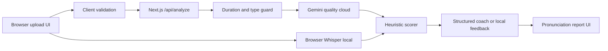

# Pronunciation Agent Architecture

## Goal

Build a public web app where a learner uploads a 30-45 second English speech sample and receives a pronunciation score, highlighted mistakes, and concrete practice steps. The assessment deadline is Sunday, July 12, 2026 at 11:59 PM IST, so the design prioritizes a small, deployable production slice over a large ML pipeline.

## Components

- Browser UI: validates file size and duration before submission, collects consent, previews audio, and renders the report.
- API route: accepts multipart upload for cloud mode, requires consent, validates file type, size, and 30-45 second duration.
- Quality cloud mode: uses Gemini `gemini-2.5-flash` through the Interactions API and Files API to transcribe audio and return structured pronunciation feedback. It falls back to `gemini-2.5-flash-lite` when the primary model is temporarily overloaded.
- Free local mode: uses Transformers.js with `Xenova/whisper-tiny.en` in the browser. It tries WebGPU/FP16 first for speed, then falls back to WASM/FP32 to avoid ONNX quantization failures. It avoids API cost and app-server upload, but scoring is based on transcript, pace, and hesitation signals rather than acoustic confidence.
- Smart compare mode: runs `tiny.en` first, scores transcript quality locally, and runs `Xenova/whisper-base.en` only when the first transcript is weak. When both run, it selects the stronger transcript using completeness, cleanliness, pace, and word-overlap agreement. This keeps latency low while adding a second local model where it is most useful.
- Heuristic scorer: computes speech rate, hesitation count, average token confidence when available, low-confidence token ratio when available, and a bounded pronunciation score.
- Structured coach: uses Gemini Structured Outputs in cloud mode; local mode uses deterministic transcript/timing feedback.
- Data layer: none in the MVP. Audio and transcripts are not persisted by the app.

## Model And API Choices

Google's Gemini docs describe free-tier pricing for `gemini-2.5-flash` and `gemini-2.5-flash-lite`, both with audio input and structured output support. This app uses Gemini for the higher-quality cloud mode because it can analyze audio and return structured JSON feedback in one request path.

The local mode uses Transformers.js Whisper because it runs directly in the browser and requires no API key or cloud quota. The trade-off is that local Whisper transcription does not expose the same pronunciation confidence evidence as a dedicated speech assessment model, so the local report clearly labels itself as a transcript/timing heuristic.

## Scoring And Highlighting

The app does not claim true phoneme-level acoustic scoring. It uses a pragmatic MVP rubric:

- Pronunciation confidence: average STT token confidence and low-confidence token ratio when available; otherwise a conservative local baseline.
- Clarity: confidence score adjusted for repeated hesitation markers.
- Fluency: filler count and low-confidence ratio.
- Pace: words per minute, with normal conversational English rewarded.
- Highlighting: low-confidence words and LLM-selected short transcript spans become learner-visible mistake cards.

This is useful for a real learner because it shows the likely problem area and gives a concrete repetition drill, while clearly avoiding overclaiming beyond the available signals.

## DPDP Compliance Posture

The app treats uploaded audio as personal data. It asks for explicit consent before processing, states the purpose in the UI, and rejects uploads unless consent is present in the server request.

Storage and retention are intentionally minimal. The app has no database, no object storage, and no server-side file writes. Local mode keeps audio in the browser. Quality cloud mode keeps audio in memory for the request, sends it to Gemini Files API for analysis, and attempts to delete the temporary Gemini file after the response.

Deletion is simple in the MVP because the app does not retain user audio, transcripts, or reports. For production accounts, a deletion/grievance contact should be added in the privacy notice. If retention is later introduced for user history, the system should add a user account, retention schedule, deletion endpoint, audit log, and data processing agreement review.

Data residency is a trade-off. The Vercel deployment and Gemini API may process data outside India depending on the account and platform settings. A production DPDP posture for Indian learners should evaluate India-region hosting, approved processor terms, and whether an India-resident model provider is required.

## Trade-offs And Next Week

- Vercel request bodies are limited, so the MVP caps files at 4 MB. Next step: direct-to-object-storage uploads with signed URLs.
- The MVP scores confidence and transcript-derived fluency, not phoneme alignment. Next step: add reference-text mode plus phoneme comparison or a specialized pronunciation model.
- There is no auth or saved history. Next step: add accounts only if users need report history, with explicit retention and deletion controls.
- The app handles English only. Next step: language detection rejection before scoring.
